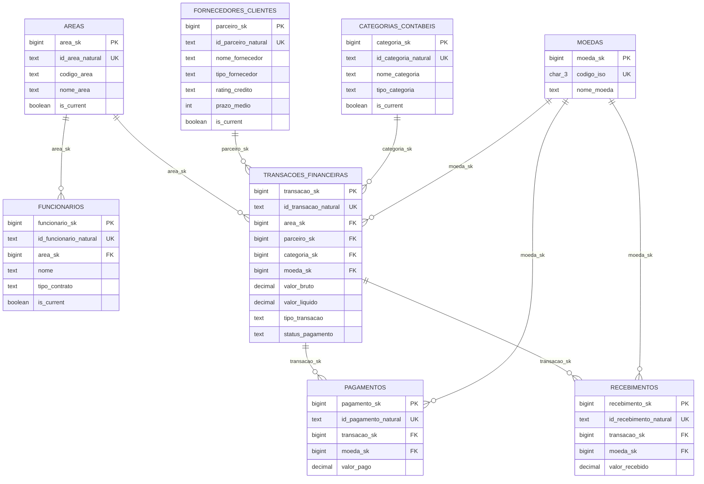
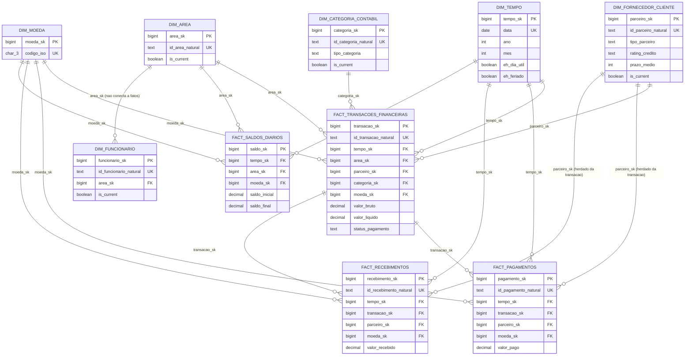
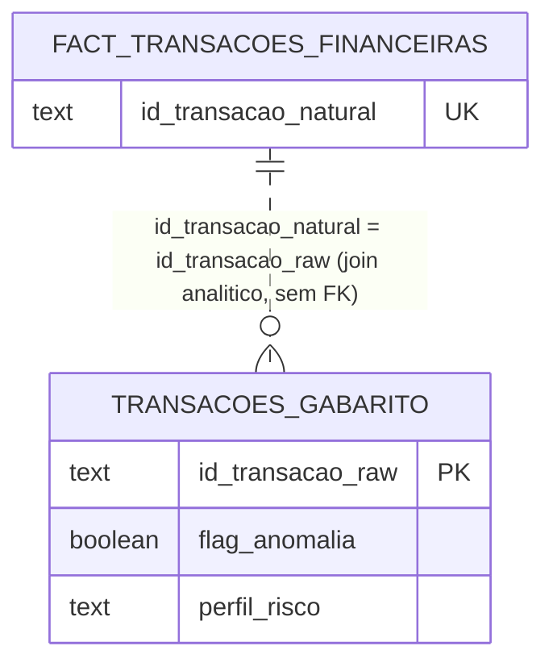

# DER — Diagrama de Entidade-Relacionamento

> Substitui os diagramas da seção 5 de `DataWarehouse_Documentacao.pdf/docx`,
> que documentam uma versão anterior do schema (ainda tinham `funcionario_sk`
> nas fatos, `status_pagamento` em `Pago/Pendente/Cancelado`, e não incluíam
> `trusted.moedas` nem o schema `ml`). Este arquivo reflete o schema
> efetivamente aplicado no RDS em 27/09/2026. Colunas de auditoria padrão
> (`etl_batch_id`, `criado_em`, `atualizado_em`, `source_system`) foram
> omitidas dos diagramas por clareza — estão listadas no dicionário de dados
> (`GUIA_REFINED_PARA_ML.md` e `DataWarehouse_Documentacao`).

## Camada TRUSTED (Silver)

Nota: `PAGAMENTOS`/`RECEBIMENTOS` não têm `parceiro_sk` próprio em
`trusted` — o parceiro é sempre resolvido via `transacao_sk`. Isso muda em
`refined` (ver abaixo).

## Camada REFINED (Gold) — Star Schema

**Status de implementação (27/09/2026):** `dim_tempo`, `dim_moeda`,
`dim_area`, `dim_categoria_contabil`, `dim_fornecedor_cliente`,
`dim_funcionario` e `fact_transacoes_financeiras` estão populadas.
`fact_pagamentos`, `fact_recebimentos` e `fact_saldos_diarios` estão
desenhadas aqui mas **ainda não implementadas** — os scripts de
`trusted_to_refined` pra elas ainda não foram escritos.

## Gabarito de anomalias (fora do Medallion)

`ml.transacoes_gabarito` não tem FK real com nenhuma tabela — é join
analítico por chave natural, só para avaliação de modelo:

